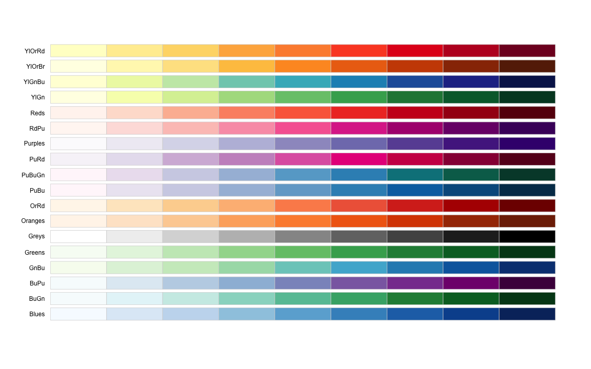
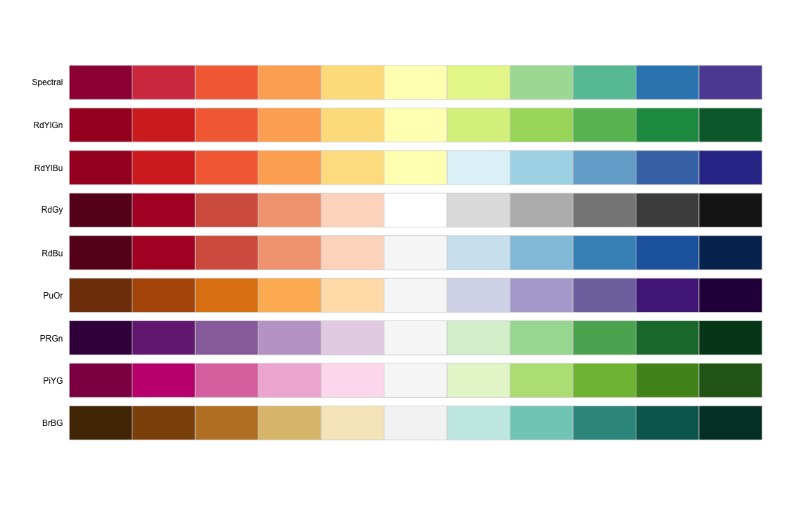
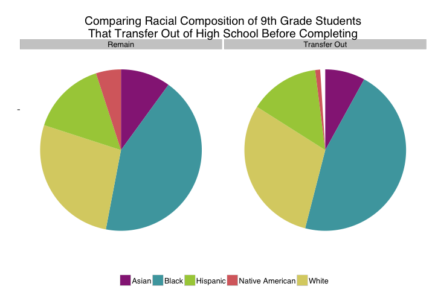
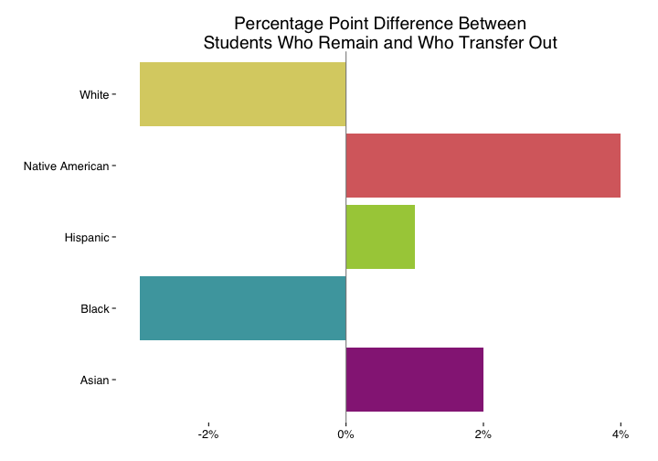
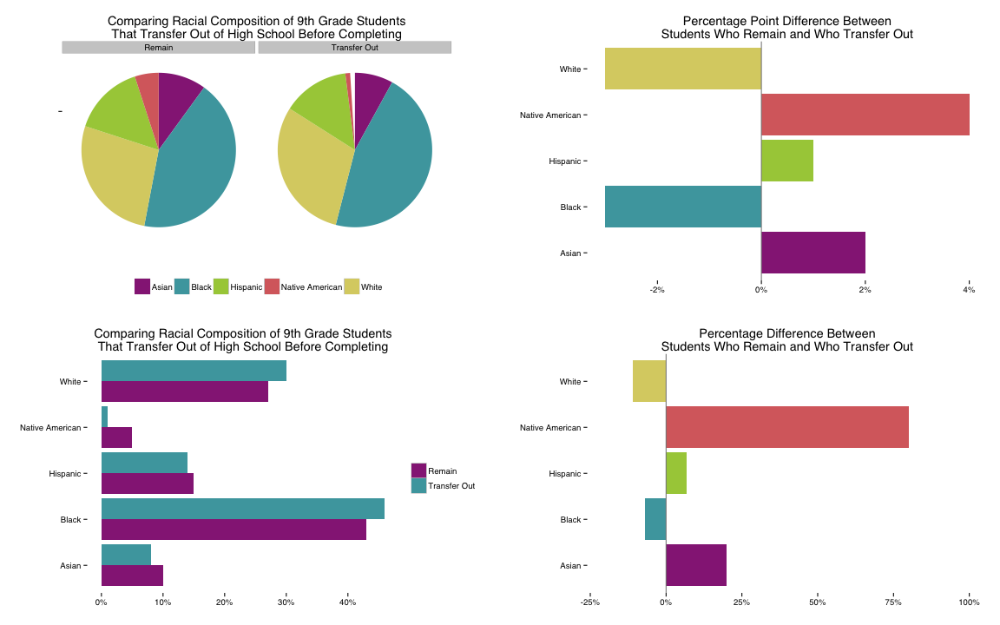

Persuasive Data Day 2
========================================================
author: Jason Becker and Jared Knowles
date: 2015-05-20

Talk Outline
========================================================

1. Iterative development process.
2. Explain. Explain. Explain.
3. Visualization in practice

User-Centered Design
========================================================
* Plan
* Research
* Design
* Pilot
* Measure
* Design
* Pilot
* Measure
* Design ...

How to Prototype 
========================================================
* Plan: What do I want my audience to learn?
* Research: Does my visualization demonstrate this?
* Design: Is my visualization *focused* on this?

How to Test
========================================================
* Pilot: Use someone representative of audience knowledge and values.
  - Explain the raw data (what each axes and shape represents)
* Measure: Ask the pattern they see in the data.
  - Explain and show the pattern you are trying to demonstrate if it is different.
  - Ask if the desired pattern is hard to *see* and/or hard to *understand*.

Iterate
========================================================
* When data is hard to *see*, consider:
  - Changing colors
  - Changing graph type.
  - Introducing labels/annotations.

Iterate
========================================================
* When data is hard to *understand*, consider:
  - Summarzing data
  - Faceting data/small multiples
  - Producing more than one visual to demonstrate concept in smaller steps.

Color
========================================================

  

    

Color Correction
========================================================

More Notes on Color
========================================================

**Qualitative**

More Notes on Color
========================================================

**Sequential**

Sequential Example
========================================================

More Notes on Color
========================================================

**Divergent**

Divergent Example
========================================================

Divergent Example
========================================================

Making Comparisons -- Four Visuals
========================================================

Making Comparisons -- Four Visuals
========================================================

Making Comparisons -- Four Visuals
========================================================

Making Comparisons -- Four Visuals
========================================================

Making Comparisons -- Four Visuals
========================================================

Surprise
========================================================

  

Why I chose it
========================================================

  

Research on best shapes
========================================================

  

[Heer and Bostock, 2010](http://idl.cs.washington.edu/papers/crowdsourcing-graphical-perception)

Axes Are Dangerous -- Never Use Two
========================================================

  

  

Axes Are Dangerous -- Never Use Two
========================================================

  

Axes Are Dangerous -- Never Use Two
========================================================

  

**More Fun**:
[Tyler Vigen -- http://www.tylervigen.com](http://www.tylervigen.com)

