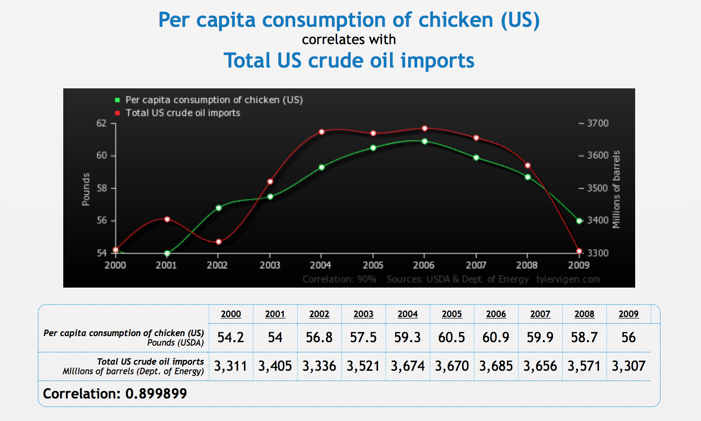
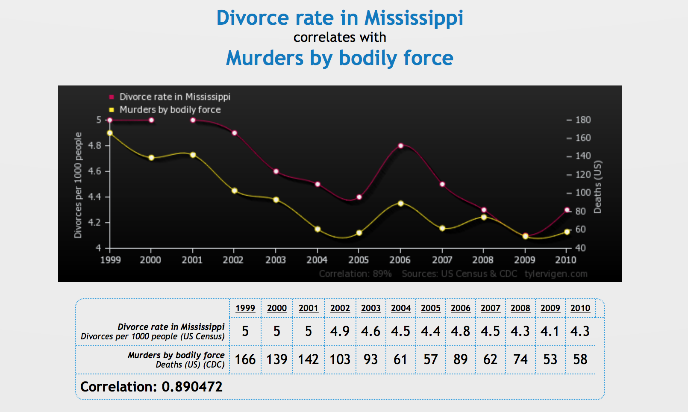

# Talk Outline

1. Data Persuasion and Not Storytelling
2. Review of Persuasive Techniques
3. Organizing a Presentation
4. Adding Visuals to Persuade
5. Closing the Argument

### Why Persuasion?

Most data presentations are attempting to make an argument. An argument is a statement offering support for a claim. Most often, we're seeking to convince someone to make a decision or to inform them about a problem that requires their attention. As data analysts, this is based on fact.

### Why not storytelling?

Storytelling is about constructing a compelling narrative, but has no need for fact.

Storytelling invites alternatives with no way to equate them.

Persuasion and argument set the ground rules, define the comparisons, and focus the audience.

### Visualization

> Of all methods for analyzing and communicating statistical
> information, well-designed data graphics are usually the
> simplest and at the same time the most powerful.

Tufte, 1983.

### Visualization Pitfalls

> The lies are systematic and quite predictable, nearly always
> exaggerating the rate of recent change.

Tufte, 1983.


### Elements of Argument

1. Claim
2. Evidence
3. Warrant

### Persuasion

- Need credibility
- Reliability and reputation

### Types of Claims

1. Claims of Fact
2. Claims of Value
3. Claims of Policy

### Support Fact

1. Sufficient and Appropriate Data
2. Credibility and reputation
3. Appeal to authority

### Causal Arguments

1. Logic
2. Sequencing
3. Followable

### Policy Claims

- Require both fact and value arguments
- Often involve direct trade offs with alternatives


### Warrants

Warrants are the assumptions that underpin the evidence.
The key is to know your audience.

- Shared understanding
- Assumed values
- Definitions

### Persuasion

1. Ethos
2. Pathos
3. Visualization

### Making Comparisons -- Four Visuals

```{r, echo=FALSE, fig.align='center', fig.height=7, fig.width=10, fig.retina=TRUE}
library(ggplot2)
library(scales)
library(RColorBrewer)
race <- data.frame(race = rep(c('Asian', 'Black', 'White', 
                                'Hispanic', 'Native American'), 
                              2),
                   transfer_status = c(rep('Remain', 5), rep('Transfer Out', 5)),
                   percent = c(0.10, 0.43, 0.27, 0.15, 0.05, 
                               0.08, 0.46, 0.30, 0.14, 0.01))

ggplot(race, aes("", percent, fill = race)) +
  geom_bar(stat='identity', position = 'stack', width = 1) +
  coord_polar(theta = 'y') +
  scale_x_discrete('') +
  scale_y_continuous('', breaks = NULL) +
  scale_fill_manual('',
                    values = c('#962A85', '#4BA5AD', '#A7CC46', '#D86C6D', 
                               '#DAD072', '#626366')) + 
  facet_grid(.~transfer_status) +
  ggtitle('Comparing Racial Composition of 9th Grade Students\nThat Transfer Out of High School Before Completing') +
  theme_bw() +
  theme(panel.border = element_blank(), 
        panel.grid = element_blank(),
        text = element_text(family = 'sans', size = 16),
        legend.position = 'bottom')

```

### Making Comparisons -- Four Visuals

```{r, echo=FALSE, fig.align='center', fig.height=7, fig.width=10, fig.retina=TRUE}
ggplot(race, aes(race, percent, fill = transfer_status)) +
  geom_bar(stat='identity', position = 'dodge') +
  scale_fill_manual('', values = c('#962A85', '#4BA5AD')) +
  scale_x_discrete('') +
  scale_y_continuous('', labels = percent_format()) +
  #facet_grid(transfer_status~.) +
  coord_flip() +
  ggtitle('Comparing Racial Composition of 9th Grade Students\nThat Transfer Out of High School Before Completing') +
  theme_bw() +
  theme(panel.border = element_blank(), 
        panel.grid = element_blank(),
        text = element_text(family = 'sans', size = 16))
                                       
```

### Making Comparisons -- Four Visuals

```{r, echo=FALSE, fig.align='center', fig.height=7, fig.width=10, fig.retina=TRUE}
library(dplyr)
library(tidyr)
library(magrittr)
race_diff <- race %>%
  spread(transfer_status, percent) %>%
  mutate(diff = Remain-`Transfer Out`)

ggplot(race_diff, aes(race, diff, fill = race)) +
  geom_bar(stat='identity', position='dodge') +
  geom_hline(y=0, color='#888888') +
  scale_fill_manual('',
                    values = c('#962A85', '#4BA5AD', 
                               '#A7CC46', '#D86C6D', 
                               '#DAD072')) +
  scale_y_continuous('', labels = percent_format()) +
  scale_x_discrete('') +
  coord_flip() +
  ggtitle('Percentage Point Difference Between\nStudents Who Remain and Who Transfer Out') +
  theme_bw() +
  theme(panel.border = element_blank(), 
        panel.grid = element_blank(),
        text = element_text(family = 'sans', size = 16),
        legend.position = 'none')

```

### Making Comparisons -- Four Visuals

```{r, echo=FALSE, fig.align='center', fig.height=7, fig.width=10, fig.retina=TRUE}
race_diff %<>% mutate(pdiff = diff/Remain)
ggplot(race_diff, aes(race, pdiff, fill = race)) +
  geom_bar(stat='identity', position='dodge') +
  geom_hline(y=0, color='#888888') +
  scale_fill_manual('',
                    values = c('#962A85', '#4BA5AD', 
                               '#A7CC46', '#D86C6D', 
                               '#DAD072')) +
  scale_y_continuous('', labels = percent_format(), limits=c(-.2,1)) +
  scale_x_discrete('') +
  coord_flip() +
  ggtitle('Percentage Difference Between\nStudents Who Remain and Who Transfer Out') +
  theme_bw() +
  theme(panel.border = element_blank(), 
        panel.grid = element_blank(),
        text = element_text(family = 'sans', size = 16),
        legend.position = 'none')

```

### Making Comparisons -- Four Visuals

```{r, echo=FALSE, fig.align='center', fig.height=10, fig.width=16, fig.retina=TRUE}
multiplot <- function(..., plotlist=NULL, file, cols=1, layout=NULL) {
  require(grid)
  plots <- c(list(...), plotlist)
  numPlots = length(plots)
  if (is.null(layout)) {
    layout <- matrix(seq(1, cols * ceiling(numPlots/cols)),
                    ncol = cols, nrow = ceiling(numPlots/cols))
  }
 if (numPlots==1) {
    print(plots[[1]])
  } else {
    grid.newpage()
    pushViewport(viewport(layout = grid.layout(nrow(layout), ncol(layout))))
    for (i in 1:numPlots) {
      matchidx <- as.data.frame(which(layout == i, arr.ind = TRUE))
      print(plots[[i]], vp = viewport(layout.pos.row = matchidx$row,
                                      layout.pos.col = matchidx$col))
    }
  }
}
multiplot(ggplot(race, aes("", percent, fill = race)) +
  geom_bar(stat='identity', position = 'stack', width = 1) +
  coord_polar(theta = 'y') +
  scale_x_discrete('') +
  scale_y_continuous('', breaks = NULL) +
  scale_fill_manual('',
                    values = c('#962A85', '#4BA5AD', '#A7CC46', '#D86C6D', 
                               '#DAD072', '#626366')) + 
  facet_grid(.~transfer_status) +
  ggtitle('Comparing Racial Composition of 9th Grade Students\nThat Transfer Out of High School Before Completing') +
  theme_bw() +
  theme(panel.border = element_blank(), 
        panel.grid = element_blank(),
        text = element_text(family = 'sans', size = 12),
        legend.position = 'bottom'),
ggplot(race, aes(race, percent, fill = transfer_status)) +
  geom_bar(stat='identity', position = 'dodge') +
  scale_fill_manual('', values = c('#962A85', '#4BA5AD')) +
  scale_x_discrete('') +
  scale_y_continuous('', labels = percent_format()) +
  #facet_grid(transfer_status~.) +
  coord_flip() +
  ggtitle('Comparing Racial Composition of 9th Grade Students\nThat Transfer Out of High School Before Completing') +
  theme_bw() +
  theme(panel.border = element_blank(), 
        panel.grid = element_blank(),
        text = element_text(family = 'sans', size = 12)),
ggplot(race_diff, aes(race, diff, fill = race)) +
  geom_bar(stat='identity', position='dodge') +
  geom_hline(y=0, color='#888888') +
  scale_fill_manual('',
                    values = c('#962A85', '#4BA5AD', 
                               '#A7CC46', '#D86C6D', 
                               '#DAD072')) +
  scale_y_continuous('', labels = percent_format()) +
  scale_x_discrete('') +
  coord_flip() +
  ggtitle('Percentage Point Difference Between\nStudents Who Remain and Who Transfer Out') +
  theme_bw() +
  theme(panel.border = element_blank(), 
        panel.grid = element_blank(),
        text = element_text(family = 'sans', size = 12),
        legend.position = 'none'),
ggplot(race_diff, aes(race, pdiff, fill = race)) +
  geom_bar(stat='identity', position='dodge') +
  geom_hline(y=0, color='#888888') +
  scale_fill_manual('',
                    values = c('#962A85', '#4BA5AD', 
                               '#A7CC46', '#D86C6D', 
                               '#DAD072')) +
  scale_y_continuous('', labels = percent_format(), limits=c(-.2,1)) +
  scale_x_discrete('') +
  coord_flip() +
  ggtitle('Percentage Difference Between\nStudents Who Remain and Who Transfer Out') +
  theme_bw() +
  theme(panel.border = element_blank(), 
        panel.grid = element_blank(),
        text = element_text(family = 'sans', size = 12),
        legend.position = 'none')
, cols = 2)

```

### Surprise

<div style="display:table-cell;vertical-align:middle;">
  <div style="margin-left:auto;margin-right:auto;"></div>
</div>

### Why I chose it
<div style="display:table-cell;vertical-align:middle;">
  <div style="margin-left:auto;margin-right:auto;"></div>
</div>

### Axes Are Dangerous -- Never Use Two
<div style="display:table-cell;vertical-align:middle;">
  <div style="margin-left:auto;margin-right:auto;">
  </div>
</div>

### Axes Are Dangerous -- Never Use Two

<div style="display:table-cell;vertical-align:middle;">
  <div style="margin-left:auto;margin-right:auto;">
</div>
</div>

### Axes Are Dangerous -- Never Use Two

<div style="display:table-cell;vertical-align:middle;">
  <div style="margin-left:auto;margin-right:auto;">
</div>
</div>

**More Fun**:
[Tyler Vigen -- http://www.tylervigen.com](http://www.tylervigen.com)

### Closing the Argument

### Resources

Rottenberg, Annette. The Elements of Argument. 7th edition. 2003.

Rad Presenters Podcast.
